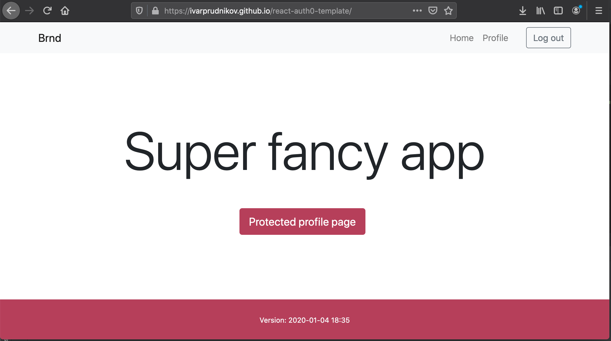

React website with Auth0 login
================================

[> Preview Live](https://ivarprudnikov.github.io/react-auth0-template/)
--------------------------------

- Project was bootstrapped with [Create React App](https://github.com/facebook/create-react-app).
- Added Auth0 steps steps from [auth0.com/docs/quickstart/spa/react](https://auth0.com/docs/quickstart/spa/react)
- Further enhancements applied as documented in [blog post](TODO)
